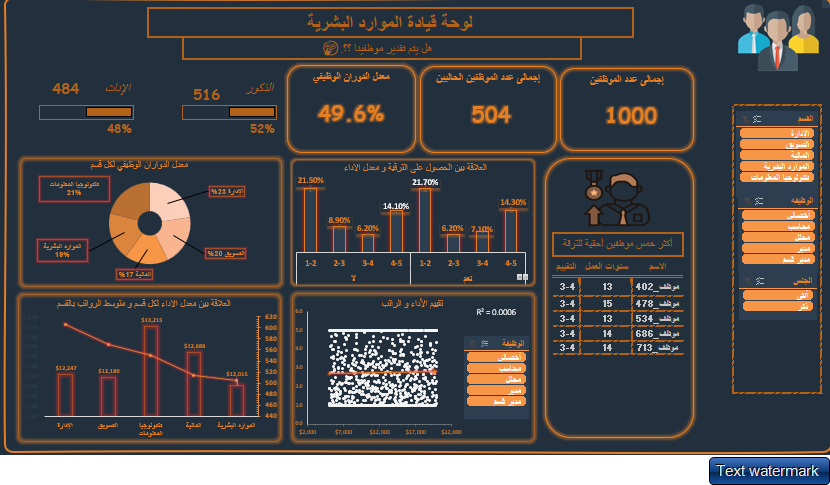

# HR Analytics Dashboard

## Overview
This project presents an interactive **Human Resources Analytics Dashboard** built entirely with **Microsoft Excel** and **Power Query**. The dashboard analyzes employee compensation fairness by exploring the relationships between performance, salaries, promotions, and departmental dynamics.

---

## Project Objectives
The dashboard aims to answer the following key questions:
1. Are high-performing employees rewarded with fair salaries?
2. Do high-performing employees receive deserved promotions?
3. Are there departments suffering from lower salaries compared to others?
4. What is the employee turnover rate across departments?

---

## Data Overview
Key columns used in the analysis:
- **Performance Rating:** Employee evaluation score.
- **Monthly Salary:** Employee's monthly salary.
- **Absence Days:** Number of days the employee was absent.
- **Years at Company:** Duration the employee has worked.
- **Overtime Hours:** Extra hours worked beyond regular time.
- **Promotion in Last 5 Years:** Indicator if the employee was promoted in the last 5 years.
- **Department & Job Title:** Organizational role and department.
- **Turnover:** Indicates whether the employee has left the company.

---

## Main Analyses
1. **Performance vs Salary** *(Scatter Plot)*
   - Weak correlation found (R² = 0.0006).
   - Some low performers earn higher salaries than high performers.

2. **Promotions vs Performance** *(Column Chart)*
   - High performers are generally promoted, but exceptions exist.
   - 14.1% of high performers (rating 4-5) weren't promoted.
   - 21.7% of low performers (rating 1-2) were promoted.

3. **Turnover Rate per Department** *(Pie Chart)*
   - Highest turnover rates observed in Marketing, IT, and other specific departments.
   - Overall turnover rate: **49.6%**.

4. **Average Salary by Department** *(Column Chart)*
   - Salary disparities exist between departments even with similar performance levels.

5. **Promotion Eligibility (Pivot Table)**
   - Employees eligible for promotion based on performance and tenure are identified.

---

## Tools & Technologies
- **Microsoft Excel:** For dashboard building and data visualization.
- **Power Query:** For data cleaning, transformation, and preparation.

---

## Key Findings
- Salary does not consistently reflect performance.
- Promotion policies need better alignment with employee performance.
- Certain departments lag in salary averages compared to others.
- High turnover rates may indicate internal issues in specific departments.

---

## Recommendations
1. Reassess salary policies to ensure fairness across departments.
2. Improve the promotion system to better reflect true performance.
3. Monitor departmental turnover and investigate underlying causes.
4. Enhance transparency in reward and compensation structures.

---

## License
This project is licensed under the MIT License.

---

## Future Improvements
- Integrate more KPIs such as employee satisfaction.
- Automate data refresh for real-time insights.
- Expand analysis with predictive models using Excel or other tools.

---

## Contact
For any inquiries or collaboration opportunities, feel free to reach out via GitHub.

